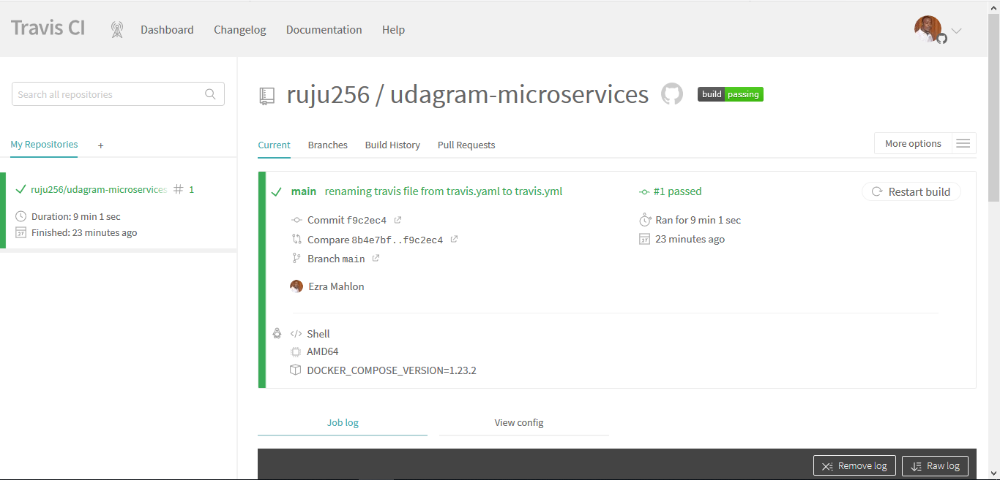
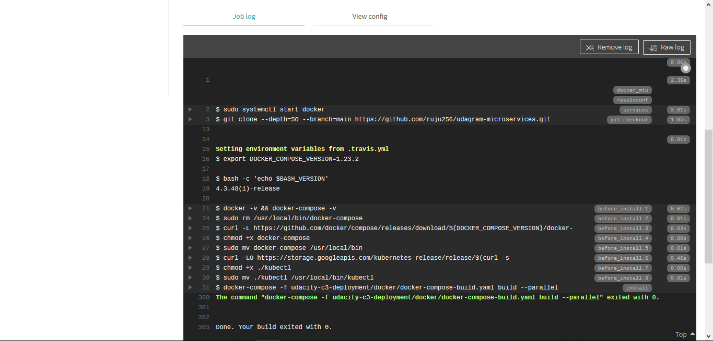
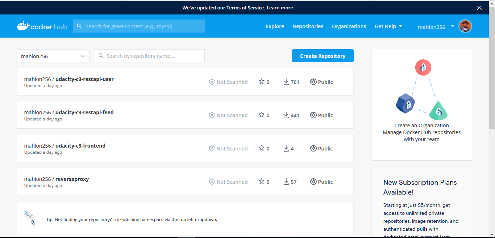
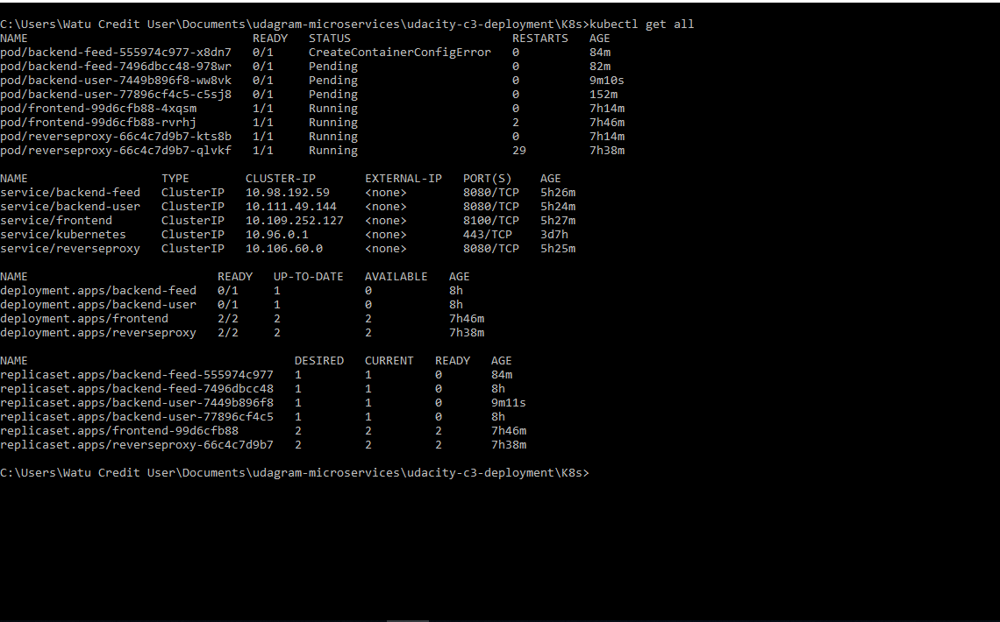

# Udagram-microservices-v1
This repository is associated with Cloud Developer ND - Course 03 - Monolith to Microservices. There are 6 lessons in this course. There is separate directory for each lesson.

# Links
Link to Travis CI : https://travis-ci.org/github/ruju256/udagram-microservices

# Screenshots

Travis CI

Dockerhub Images

List of pods

